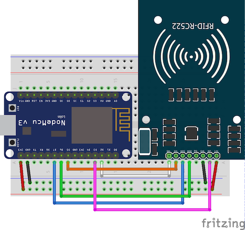

# rfid-rc522
Contoh penggunaan rfid menggunakan reader rc522 pada esp8266 amica

## Kebutuhan perangkat
Adapun untuk melakukan percobaan ini dibutuhkan beberapa perangkat seperti
+ ESP8266 Amica, boleh lolita
+ Reader MFRC522
+ Kabel sebanyak 7 buah
+ Breadboard
+ Library dapat diunduh di [https://github.com/miguelbalboa/rfid.git](https://github.com/miguelbalboa/rfid.git)

## Fritzing
Untuk konfigurasi pengkabelan dapat dilihat pada gambar di bawah ini

File fritzing dapat diunduh di [MFRC522.fzz](MFRC522.fzz)

## Tabel skematik
Untuk lebih jelaskan dapat dilihat pada tabel di bawah ini
| ESP8266 Amica | RFID\-RC522                        |
|---------------|------------------------------------|
| D2            | SDA                                |
| D5            | SCK                                |
| D7            | MOSI                               |
| D6            | MISO                               |
|               | IRQ                                |
| GND           | GND                                |
| D3            | RST                                |
| 3V3           | 3\.3V                              |
